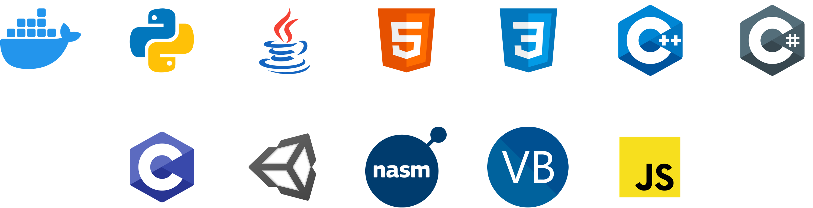

Welcome!

This is <b>Lorenzo Rocca</b> 👋

    <a href="https://www.youtube.com/@LoRy24">YouTube</a> •
    <a href="https://www.instagram.com/lory24_yt/">Instagram</a> •
    <a href="https://www.lory24.dev/">Website</a> •
    <a href="https://discord.lory24.dev/">Discord</a>

📊 Stats:

    
    
    
    

📜 My Career (Briefing):

    My real career started about 3/4 years ago, after I've made a lot of experience with almost all the fundaments of the Computer Science. In the past time, I've worked mostly on Java development (Spigot and Software Development), but with my experience I can identify myself as a <b>Full Stack Developer</b>, because I'm in the position of code Front-End and Back-End systems. Little secret: I love 😍 working with complex systems!

📚 I can work with or I'm studying:

    

